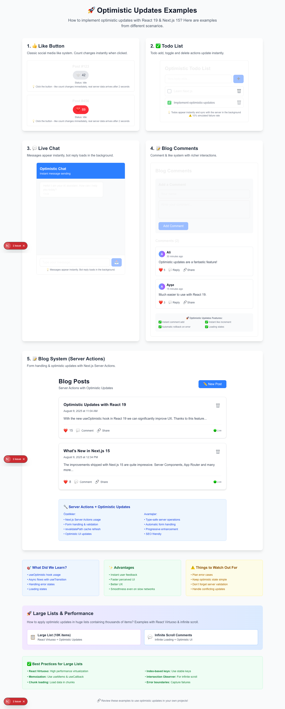

# React 19 + Next.js 15 Optimistic Updates Demo



A showcase project demonstrating different optimistic UI patterns using React 19 `useOptimistic` and `useTransition` in a Next.js 15 App Router application.

## ✨ Features
- React 19 `useOptimistic` for instant UI feedback
- `useTransition` for non-blocking async state updates
- Multiple real‑world scenarios (likes, todos, chat, comments, blog CRUD, large virtualized list)
- Error simulation + graceful rollback
- Virtualized large data set (10,000 items) with React Virtuoso
- Infinite / scalable patterns foundation

## 📂 Example Scenarios
| # | Example | File | Concepts |
| - | ------- | ---- | -------- |
| 1 | Like Button | `src/app/components/LikeButton.tsx` | Single action, count adjustment, rollback |
| 2 | Todo List | `src/app/components/OptimisticTodoList.tsx` | Add / toggle / delete, temp IDs |
| 3 | Chat | `src/app/components/OptimisticChat.tsx` | Streaming feel, sending / failed states, retry |
| 4 | Comments | `src/app/components/OptimisticComments.tsx` | List prepend, optimistic like adjust |
| 5 | Blog (Server Actions) | `src/app/components/OptimisticBlog.tsx` + `src/app/actions.ts` | Create / like / delete with server revalidation |
| 6 | Large Virtualized List | `src/app/page3/page.tsx` | 10K items, filters, search, optimistic add/like/delete |
| 7 | Error Scenario (Form) | `src/app/page2/page.js` | High failure rate, optimistic rollback, UI feedback |

## 🧠 Optimistic Update Pattern
Generic pattern applied across components:
```tsx
const [optimisticValue, applyOptimistic] = useOptimistic(actualValue, reducer);

function onUserAction(payload) {
  // 1. Apply optimistic state instantly
  applyOptimistic(payload);

  // 2. Spawn async transition
  startTransition(async () => {
    try {
      const serverResult = await doServerWork(payload);
      // 3. Reconcile authoritative data
      setActualValue(serverResult);
    } catch (e) {
      // 4. Implicit rollback (optimistic base changes discarded)
      reportError(e);
    }
  });
}
```

## 🛠 Tech Stack
- Next.js 15 (App Router, Server Actions)
- React 19 (useOptimistic, useTransition)
- TypeScript
- Tailwind CSS 4
- React Virtuoso (virtual scrolling)

## 🚀 Getting Started
Install dependencies and run the dev server:
```bash
npm install
npm run dev
```
Then open http://localhost:3000

Large list demo: http://localhost:3000/page3
Error scenario form: http://localhost:3000/page2

## 📁 Key File Structure
```
src/app/
  page.tsx                # Landing page with links to all examples
  page2/page.js           # Error / rollback form demo
  page3/page.tsx          # Virtualized large list demo
  components/
    LikeButton.tsx
    OptimisticTodoList.tsx
    OptimisticChat.tsx
    OptimisticComments.tsx
    OptimisticBlog.tsx
    InfiniteScrollComments.tsx (extra pattern)
  actions.ts              # Server Action simulations
```

## ⚠️ Error Handling Strategy
| Aspect | Approach |
| ------ | -------- |
| Random failure | Math.random() with small probability |
| Rollback | Let optimistic layer diff revert after catch |
| User feedback | Inline labels / badges / alert() placeholders |
| Retry (chat) | Manual retry button for failed messages |

## 🧪 Simulated Latencies
| Action | Delay |
| ------ | ----- |
| Like toggle | ~2s (like button) / 300ms (list) |
| Create Todo | 1.5s |
| Toggle Todo | 1s |
| Delete Todo | 0.8s |
| Blog create | 2s |
| Chat bot reply | 2–4s |
| Large list add | 1.2s |

## 🧩 Large List Virtualization
Implemented with React Virtuoso:
- Only visible DOM rows rendered
- `overscan` tuned for smooth scroll
- Independent optimistic mutations safe (array prepend / map / filter)

## ✅ Best Practices Applied
- Immutable update helpers (`map`, `filter`, prepend)
- Temp IDs prefixed with `temp-` for identification
- Optimistic metadata flags (`isOptimistic`, `sending`, `status`)
- Narrow UI re-renders via component boundaries
- Graceful degradation (alerts can be replaced with toasts)

## 🔍 Extending This Project
Ideas to explore next:
- Persist layer (database + real Server Actions)
- WebSocket or SSE real‑time reconciliation
- Offline queue & replay
- Error boundary + toast system
- Pagination + infinite scroll for comments

## 📖 Additional Guides
See `LARGE_LISTS_GUIDE.md` for more detailed notes on virtualization + performance.

## 🗺 Roadmap
- [ ] Replace alert with toast notifications
- [ ] Add optimistic reorder / drag & drop
- [ ] Add mutation conflict resolution example
- [ ] Integrate real API / DB

## 📝 License
MIT (adjust as needed).

---
Feel free to fork, experiment, and adapt these patterns to your own production flows.
